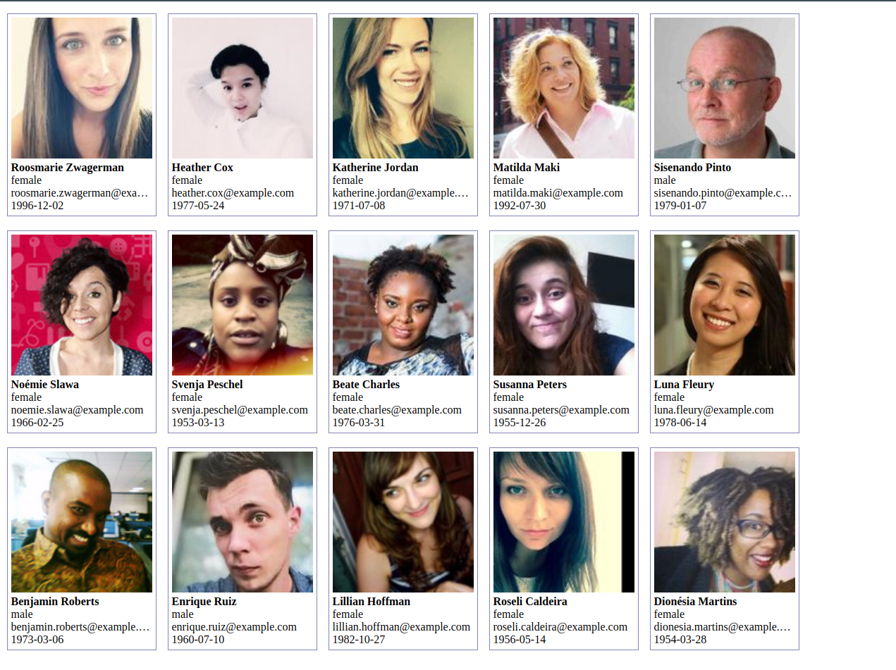

## Написать мини социальную сеть используя https://randomuser.me/api/ API.

## Requirements:
- каждое задание необходимо оформить отдельным коммитом;
- установка eslint, prettier, husky будет плюсом;
- css-оформление на ваше усмотрение;
- '***' - будет большим плюсом если сделаете;
- задания делаете по мере ваших сил, то что сможете.

1. Используя API выше, достать 15 случайных пользователей и вывести как на скрине ниже.
Необходимо показать следующие данные:
   - фото;
   - first_name + last_name;
   - gender
   - дату рождения в формате (yyyy-mm-dd)

2. Добавьте фильтр по полю gender и nationality:
- добавьте фильтр gender (all, male, female);
- добавьте поле 'nationality' в карточку;
- добавьте фильтр nationality (v1.3: AU, BR, CA, CH, DE, DK, ES, FI, FR, GB, IE, IR, NO, NL, NZ, TR, US);
- добавьте возможность выбрать несколько национальностей;
- все фильтры должны примениться только после нажатия на кнопку 'Apply filters';

- '***' компонент не должен перерендеривается до того как вы не нажали на кнопку 
  'Apply filters'(как это бывает после изменения состояния компонента);
- '***' фильтры не должны сбрасываться после перезагрузки страницы.

