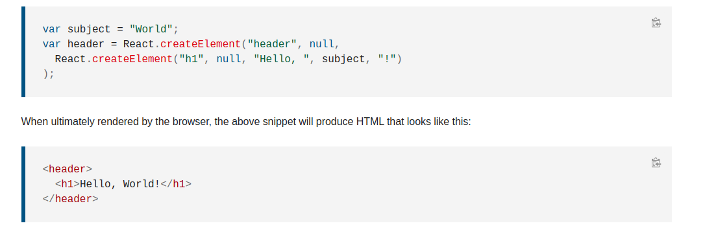
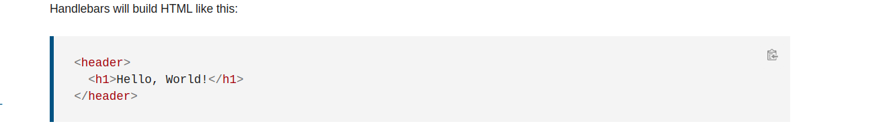
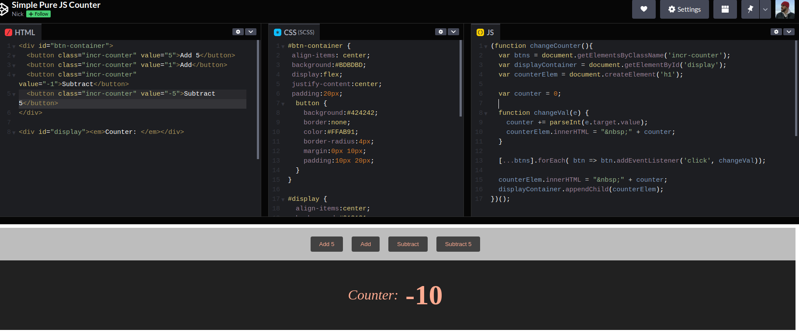
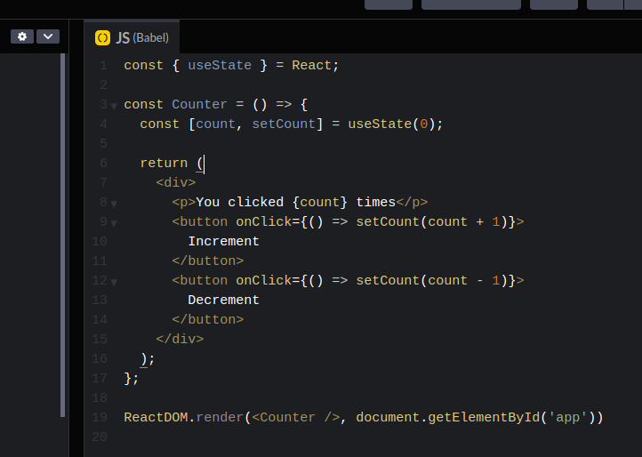
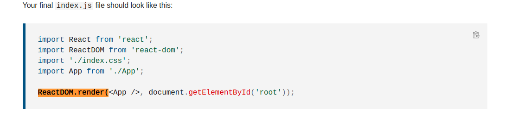
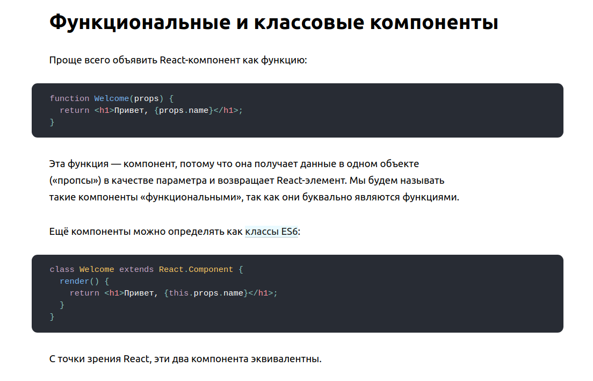
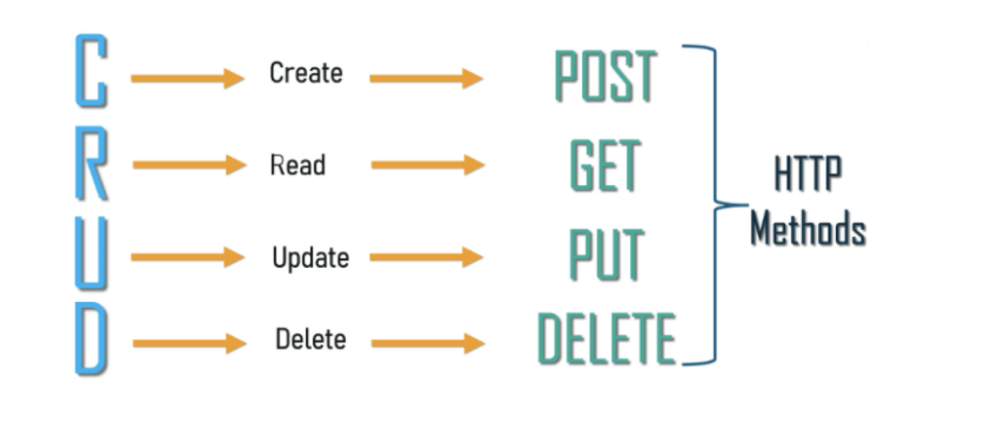
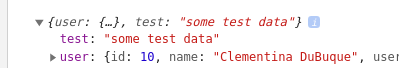
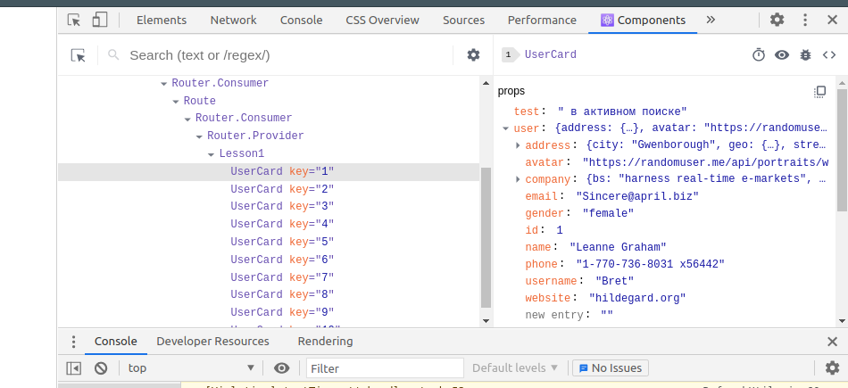

Привет, всем. Меня зовут Сергей. Я full-stack разработчик.
Пишу на JS(React) + ruby(RoR)

Сегодня наше первое, вступительное занятие на которым мы познакомимся с реактом.

Я лично рассчитываю что вы уже имели возможность познакомится с данной технологией.
Занятие будет больше теоретическое, буду говорить о базовых концепциях, после вы сможете задать вопросы.

Итак, Реакт - это популярная библиотека для создания пользовательских интерфейсов 

https://media.netflix.com/en/
Пользовательский интерфейс - это видимая пользователю часть приложения.

Сейчас это самая популярная библиотека. Примеры известных сайтов на React 

https://www.clariontech.com/blog/top-10-websites-built-on-react.js?hs_amp=true

Реакт позволяет создавать переисполняемые UI-компоненты(кнопки, модалки, формы, карточки, дропдаун, whatever)

https://media.netflix.com/en/

Способ создания пользовательских интерфейсов из компонентов называется компонентный подход.
У вас получается своего рода конструктор.
Эта идея не новая, но реакт стала первой библиотекой которая, предложила идею использовать этот подход с использованием чистого JS.
Реакт-компонент - это функция, которая создаёт для вас html-элемент или дерево вложенных друг в друга таких элементов.
По сути, весь документ рисуется на JS. Это очень похоже на создание элементов с помощью
document.createElement, но намного удобнее, меньше кода, производительнее и имеет кучу других плюсов.

Вот так вот выглядит создание кусочка HTML на чистом реакте. Функция внутри которой другая функция. 
Здесь мы можем увидеть что у нас есть JS класс `React` который создаёт элемент с помощью метода `createElement`.
И на выходе имеем такой HTML. Сложно:)
https://developer.mozilla.org/en-US/docs/Learn/Tools_and_testing/Client-side_JavaScript_frameworks/Main_features

Чистый React.createElement выглядит сложным и нечитабельным, поэтому для создания компонентов существует 
любимый всеми JSX(HTML подобный шаблонизатор который позволяет писать компоненты комбинирую HTML + JS)

Дальше ...
Реакт - это библиотека для управления состоянием
Состояние - информация которая хранится в оперативной памяти пока вы взаимодействуете с сайтом и не закрыли/перезагрузили вкладку, любые результаты вычислений.
Открытые списки, выбранные чекбоксы, текст в инпутах, загружённые с api данные.
(Пример нетфликса как на скрине выше)

Продемонстрирую управления состоянием:

https://codepen.io/jenkizenki/pen/dOPMXd

Вот пример счётчика кликов на чистом JS.
Есть 4 кнопки, ивент лисенеры на каждой, переменная которая хранит состояние количества кликов, отдельно html и JS.
При клике на любую кнопку мы меняем состояние переменной count, получаем элемент 
в котором должны показать это значение и перетираем старое значение новым.

И пример на React

https://codepen.io/Nisargshah02/pen/oNvwrWo

Как мы видим - нет чистого html, читабельно, реакт автоматически обновляет состояние переменной count в DOM-e.

Реакт даёт набор инструментов для управления этим состоянием. В данном примере это специальная функция(хук) useState.

Он следит за изменениями и автоматически перерисовывает те элементы, состояние которых изменилось. 
Это избавляет вас от огромного количества проверок и шаблонного кода, а также позволяет создавать страницы очень быстро и легко.

Virtual DOM - механизм в реакте, который позволяет очень быстро перерисовывать страницу.
Подробно почитать можно здесь 
https://habr.com/ru/company/macloud/blog/558682/

Реакт создаёт копию реального дома в виде js объекта, и благодаря особому механизму все вычисления производит именно с ним, а затем меняет уже частично реальный DOM. 

Эта штука работает быстрее чем аналогичный механизм нативного DOM, благодаря чему реакт работает очень быстро и за это проучил своё название.
Метод который создаёт вмртуальный DOM на основе компонента 'App' и всех вложенных в него компонентов и затем монтирует его в HTML.

`ReactDOM.render(element, document.getElementById('root'));`

https://ru.reactjs.org/docs/rendering-elements.html

Для минимальной работы с react достаточно подключить react и react-dom библиотеки(показать в коде).

Но, обычно приложения создаются с помощью специального конструктора CRA https://github.com/facebook/create-react-app

Install CRA - `npm install -g create-react-app`

Также нужно будет установить Node и npm(или yarn).

CRA new App - `npx create-react-app react-overview`

Под капотом:

`webpack, babel, dev-server, hot-reload и куча других полезняшек` Мы к этому вернёмся

StrictMode - строгий режим, стоит по умолчанию в CRA - https://ru.reactjs.org/docs/strict-mode.html
Выдаёт ворнинги если вы используете устаревшие или небезопасные методы реакта в коде.

Генерируете CRA `npx create-react-app react-overview`
CRA Folder Structure - https://create-react-app.dev/docs/folder-structure

React-приложение построено на компонентах, как уже сказали ранее.
Компоненты можно разделить на классовые и функциональные
https://ru.reactjs.org/docs/components-and-props.html

Сейчас пошла мода писать на функциональных компонентах.
У каждого из этих типов есть свои особенности которые мы рассмотрим в будущем.

https://wezom.com.ua/blog/chto-takoe-spa-prilozheniya

Сайты(приложения) делятся на Multi Page Application и Single Page Application

У многостраничных приложений каждая страница приложения - это отдельная страница

У одностраничных - html-файл скачивается всего один раз, а дальше все необходимые данные получаются
путём отправки специальных http-запросов на сервер(API) без перезагрузки страницы. Технология AJAX.
Сервер отдаёт браузеру ответ в формате XML или JSON.

Далее мы будем работать с JSON-форматом, который выглядит следующим образом.
На основании этих данных мы будем отрисовывать контент 
https://jsonplaceholder.typicode.com/users

Это пример ответа при обращении к API специального тестового сайта jsonplaceholder.typicode.com
с просьбой получить коллекцию случайных пользователей.

Точно также мы будем обращаться к нашему серверу и он нам будет возвращать данные в таком же формате.

Наша основная задача будет заключаться в том, чтобы эти данные получить и отобразить

https://habr.com/ru/post/483202/ - почитайте эту статью

Немного о REST - это архитектурный стиль, а REST API - приложения которые этому стилю следуют.

https://medium.com/geekculture/crud-operations-explained-2a44096e9c88

Основные сущности REST API это RESOURCE + HTTP + CRUD

REST API представляет наши данные в виде ресурса 
и определённых действий над ним с помощью отправки http-запроса по определённому адресу.
Примеры таких запросов хорошо описаны в документации 

https://jsonplaceholder.typicode.com/guide/

Типичный пример CRUD - это список задач(TODO List).
Здесь ресурс - это задача.

https://www.nicesnippets.com/upload/blog/1591966234_show-livewire.png

Если будете писать свои REST API, то пути для работы с ресурсом должны выглядеть так.
Таким образом, любой разработчик может сразу понять что здесь происходит.

Но, на данный момент, для простоты примеров, мы будем использовать фейковые данные пользователей которые 
я сохранил локально в файле(users.json)

Итак, у нас есть коллекция(список) из 10 пользователей и мы хотим её отобразить в виде списка. Для этого нам нужно:
1. Импортировать пользователей в наш компонент. Webpack, который у нас уже под капотом в CRA-приложении, 
позволяет нам импортировать json-файл автоматически преобразуя его в массив объектов или объект. 
`   console.log(users)
`
2. Для того чтобы отрисовать список пользователей мы используем javascript оператор map. 
   https://ru.reactjs.org/docs/lists-and-keys.html
   
   map нам вернёт массив React-компонентов которые мы сможем вставить в наш JSX c помощью фигурных скобок.
3. В консоли получаем предупреждение 
   `Warning: Each child in a list should have a unique "key" prop.`
   
   Реакт нам подсказывает, где искать решение нашей проблемы. 
   Там у нас ссылка на страницу выше только на английском.
   
   Для того чтобы реакт работал со списками эффективно, нам нужно добавить к каждому элементу специальный аттрибут `key`.
   
   Этот ключ должен быть уникальным в текущем списке и нужен самому реакту для того чтобы эффективно работать с элементами списка.
   
   Ключи нужны тогда когда ваш список может меняться, например вы можете удалять или добавлять элементы списка динамически.
   (Но, реакт ругается всегда если видит что у вас нет в списке ключей).
   
    Проще говоря - если у вас нет ключей и вы удалили элемент в список - реакт перерисует весь список, 
   если есть - только данный элемент. 
   
    В качестве ключей нельзя использовать индексы массива 
   т.к. после удаления элемента из списка(он удалится из массива и индексы у данного массива изменятся).
   Это считается анти-паттерном, то есть так делать нельзя.
   
В общем имеем скромный список пользователей

Давайте рассмотрим такую штуку как условный рендеринг https://ru.reactjs.org/docs/conditional-rendering.html

В зависимости от пола, будем добавлять Miss или Mr. к именам. А для девушек напишем приветствие 'в активном поиске'

Итак, как мы можем увидеть в документации, существует 2 типа условий(и его разновидности). Это 'if' и 'if-else'
 1. if - рендерит какой-то JSX если условие не будет null, undefined или false. 
    В противном случае - этот JSX просто не отобразится в реальном DOM
 1. if-else - логично, вернёт первое или второе значение

Первым реализуем if-рендеринг, добавим статус девушкам используя JS-оператор && (И).
В качестве значений для такого рода проверок лучше использовать константы
(Чтобы не опечататься и при необходимости изменить какое-то значение просто в одном месте проекта)

Далее реализуем if-else рендеринг c помощью тернарного оператора JS.

Также, учитывая что мы делаем проверку на gender в двух местах, есть смысл вынести эту проверку в отдельное выражение

Также этот кусочек можно переписать используя JS шаблонные литералы

Давайте поговорим о самих компонентах и для этого вынесем данные пользователя в отдельный компонент UserCard

1. Создаём компонент UserCard в глобальной папке Components. 
   В React вы сами строите архитектуру своего приложения, то есть нет каких-то конкретных требований 
   по поводу того где и как вы должны размещать и именовать ваши файлы.
   
   Но, существует распространённая практика размещать общие(переиспользуемые) компоненты в папке components.
   И данный компонент карточки мы сможем использовать в других компонентах или страницах.
   
   Условные страницы приложения(SPA) часто размещают в папке Scenes или Pages.
   Если наша страница(сцена) имеет свои личные компоненты(те, которые есть только у неё, и вряд ли будут нужны
   где-то в других местах приложения), то их можно разместить в папочке components которая создаётся в папке 
   нашей сцены(страницы). 
   Таким образом будет соблюдена модульность и чистота нашего компонента(страницы/сцены) и структуры приложения в целом.
   
   Я предполагаю, что компонент карточки пользователя будет использоваться и на других страницах, другими компонентами
   поэтому разместил его в глобальной папке Components.
   
   Пока создадим тестовую карточку без данных пользователя. 
   
   Компонент принимает аргумент props - сюда попадают наши параметры компонента(пропсы).
   Название может быть любое. 
   
2. Перепишем выражение usersList возвращая массив компонентов UserCard. 
   В каждый компонент параметрами передаём данные текущего пользователя для того ещё какие-то фейковые данные что бы
   показать как работает props компонента.

3. Выводим props нашего нового компонента и видим что это объект ключами которого выступают передаваемые компоненту параметры
   `test` и `user`
   
   
   
4. Пробуем вывести данные пользователя
  Eslint ругается на отсутствие prop-types в моём компоненте.
`   ESLint: 'user' is missing in props validation(react/prop-types)
` 
   PropTypes используют для отлова ошибок с помощью проверки типов.
   https://ru.reactjs.org/docs/typechecking-with-proptypes.html
   ``
   Это отдельная библиотека которую нужно установить.
   С помощью её мы можем типизировать наши пропсы и избежать ошибок в дальнейшем при использовании нашего компонента.
   
   Например, наш проп `user` объект у которого должны быть ключи `id, name, gender`. Часто бывает, что вы или другие 
   разработчики, переиспользуя компонент userCard могут передать другой объект `user` у которого нет ключа `gender` 
   или вообще не передать этот проп. В таком случае мы получаем ошибки.

   PropTypes - TypeScript на минималках. Если вам нужна более строгая типизация, то лучше использовать TS или Flow.

5. Установим библиотеку и типизируем наши пропсы `user` и `test`(он будет опциональным).
   `yarn add prop-types` - поинвестигейтить чего он не в dev dependencies
   Скопируем пример proptypes из документации и заменим нашими данными.
   
   test - ошибка,`ESLint: propType "test" is not required, but has no corresponding defaultProps`
   Т.к это параметр не обязателен, но мы его используем в компоненте, то нам необходимо указать дефолтное значение
   
   Если мы укажем неправильные типы для наших параметров - в консоли получаем предупреждение
   `index.js:1 Warning: Failed prop type: Invalid prop `user` of type `object` supplied to `UserCard`, expected `string`.
   
   Нам нужно правильно описать параметр `user`, как минимум, чтобы там были ключи которые мы используем в компоненте

6. Описываем prop `user`
   
   Нам нужно описать объект с определёнными ключами
   
   Заходим в документацию на Github https://github.com/facebook/prop-types и находим подходящий пример
   
   Нам подходит  // An object taking on a particular shape. Копируем его себе.

   Мы описали пропсы и указали дефолтное значение для параметра test
   
Реальное приложение будет состоять из множества компонентов(как конструктор) - это называется 
композиция компонентов или компонентный подход.

React Dev Tools - расширение для Chrome(и, возможно, не только). Инструмент, который позволяет заниматься отладкой
вашего приложения.

https://chrome.google.com/webstore/detail/react-developer-tools/fmkadmapgofadopljbjfkapdkoienihi?hl=ru

Показывает нам props и состояние наших компонентов, название компонентов, хуки и не только. 

Можно менять состояние(например gender). Может быть полезно при отладке приложения(то го же условного рендера(gender))

ДЗ 
- установить node и npm(yarn)
- установить CRA
- сгенерировать новый проект